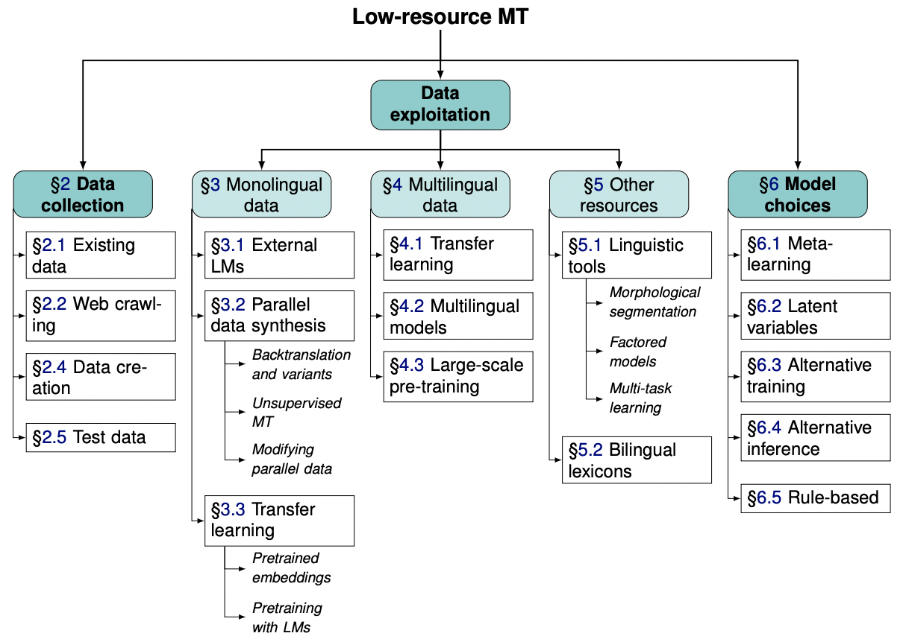
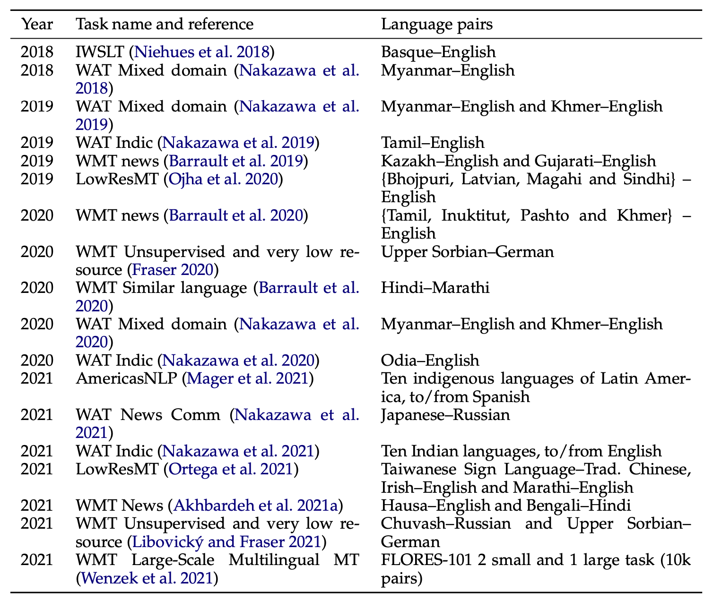

In this post, I would like to introduce a survey paper titled **[Survey of Low-Resource Machine Translation](https://arxiv.org/pdf/2109.00486.pdf)** from arrive, which is writen by the team of *University of Edinburgh*.

Current Machine Translation (MT) model are typically trained on data sets consisting of tens or even hundreds of millions of parallel sentences. Data sets of this magnitude are only available for a small number of highly resourced language pairs (typically English paired with some European languages, Arabic and Chinese). The reality is that for the vast majority of language pairs in the world the amount of data available is extremely limited, or simply non-existent. We called this language with limited resources as low-resource languages and the low-resource language MT research is chanllenging.

There are currently a number of other survey papers in related areas, for example a survey of monolingual data in low-resource NMT ([Gibadullin et al., 2019](https://arxiv.org/abs/1910.00373)) and a survey of multilingual NMT ([Dabre et al., 2020](https://arxiv.org/abs/2001.01115)). There have also been two very related surveys of low-resource MT ([Ranathunga et al., 2021](https://arxiv.org/abs/2106.15115), [Wang et al., 2021](https://arxiv.org/abs/2107.04239)). I highly recommend interested readers to read the relevant survey papers above for a more in-depth understanding of the research on machine translation.

In this survey, the authors aims to provide the broadest coverage of existing research in the field and they also contribute an extensive overview of the tools and techniques validated across 18 low-resource shared tasks that ran between 2018 and 2021. The following figure shows how we structure the diverse research methods addressing low-resource MT, and this paper follows this structure.

 

<b>Overview of research methods covered in this survey</b> (Haddow et al., 2021)

In **data collection** part, They discuss the commonly used data sets and how to extract more data we can use to train the MT model from website. Also they summarize some useful sources of monolingual, paralllel  and benchmarking test data in Table 2 of the original paper, please go to the paper to see the specific summaries.

For low-resource language pairs, parallel text is, may not yield sufficient text to train high-quality MT models. However, monolingual text will almost always be more plentiful than parallel, and leveraging monolingual data has therefore been one of the most important and successful areas of research in low-resource MT. In **monlingual** part, they provide an overview of the main approaches used to exploit monolingual data in low-resource scenarios. They focused on the following three questions:

- How to integrating external language models into NMT?
- How to using synthesis parallel data generate from monolingual data?
- How can we do transfer learning using monolingual data only?

The use of monolingual data for low-resource has previously been surveyed by [Gibadullin et al., 2019](https://arxiv.org/abs/1910.00373), who choose to categorise methods according to whether they are architecture-independent or architecture-dependent. We recommend the readers to read this paper to understand the monolingual data using technologies in low-resource MT.

In **multilingual data** part, they consider a different but related set of methods, which use additional data from different languages (i.e. in languages other than the language pair that we consider for translation). These multilingual approaches can be roughly divided into two categories: (i) transfer learning and (ii) multilingual models.

In **other resources** part, they first introduce some linguistic tools and resources using in low-resource MT, such as morphological segmentation, factored models, multi-task learning, interleaving of linguistic information in the input and syntactic reordering. Then they discuss the techniques of using bilingual lexicon in low-resource MT scenarios.

In **model techniques** part, they explore work that aims to make better use of the data we already have by investigating better modelling, training and inference techniques, which contains the following techniques:

- **Meta-Learning**. rather than training a system to directly perform well on a single task or fixed set of tasks (language pairs in our case), meta-learning  systems can be trained to quickly adapt to a novel task using only a small number of training examples, as long as this task is sufficiently similar to tasks seen during (meta-)training.
- **Latent variable models**. Latent variable models enable a higher model expressivity and more freedom in the engineering of the inductive biases, at the cost of more complicated and computa- tionally expensive training and inference.
- **Alternative training objectives**. When an autoregressive model is trained to optimise the cross-entropy loss, it is only exposed to ground-truth examples during training. When this model is then used to generate a sequence with ancestral sampling, beam search or another inference method, it has to incrementally extend a prefix that it has generated itself.
- **Alternative inference algorithms**. In NMT, inference is typically performed using a type of beam search algorithm with heuristic length normalisation. Ostensibly, beam search seeks to approximate maximum a posteriori (MAP) inference, however it has been noticed that increasing the beam size, which improves the accuracy of the approximation, often degrades translation quality after a certain point.
- **Rule-based approaches**. Rule-based machine translation (RBMT) consists in analysing and transforming a source text into a translation by applying a set of hand-coded linguistically motivated rules.

In **evaluate** part, they introduce the concept of manual or automatic evaluation.

In **shared task** part, they survey the shared tasks that have included low-resource language pairs, and  draw common themes from the corresponding sets of system description papers, putting into perspective the methods previously described in this survey. The following table contains the shared tasks related low-reousce MT:

<b>Shared tasks that have included low-resource language pairs.</b> (Haddow et al., 2021)

And also, they introduce the commonly used techniques in the shared tasks containing:

- Data preparation
- Data pre-processing
- Model architectures and training
- Using additional data
- Model transformation and finalisation

------

In summary, this is a survey paper for those reseachers intersting in low-resource MT. we recommend the readers to read more deepth in this paper. For a summary notes and reference paper in this paper, we have writen more details in a mind map [here](https://github.com/lavine-lmu/nlp_survey_paper_notes/blob/main/MT/loresMT/Low-Resource%20Machine%20Translation.xmind).